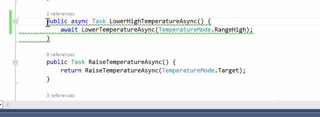
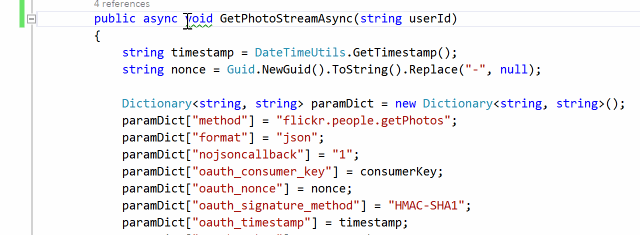

Here are async/await *misuses* (i.e., anti-patterns) that AsyncFixer can currently detect:

### AsyncFixer01: Unnecessary async/await usage

There are some async methods where there is no need to use async/await keywords. It is important to detect this kind of misuse because adding the async modifier comes at a price. AsyncFixer automatically removes async/await keywords from those methods.

### AsyncFixer02: Long-running or blocking operations inside an *async* method

Developers use some potentially long-running or blocking operations inside *async* methods even though there are corresponding asynchronous versions of these methods in .NET or third-party libraries. Some examples for such operations: *Task.Wait()*, *Task.Result*, *StreamReader.ReadToEnd()*, *Thread.Sleep()*, etc.

AsyncFixer automatically replaces those operations with their corresponding asynchronous operations and inserts an *await* expression. For instance, it converts *Thread.Sleep(...)* to *await Task.Delay(...)*.

### AsyncFixer03: Fire & forget *async void* methods

Some async methods are 'fire & forget', which return *void*. Unless a method is only called as an event handler, it must be awaitable. Otherwise, it is a code smell because it complicates control flow and makes error detection & correction difficult.

AsyncFixer automatically converts *void* to *Task*.

 

### AsyncFixer04: Fire & forget async call inside a *using* block

Inside a *using* block, developers insert a fire & forget async call which uses a disposable object as a parameter or target object. It can cause potential exceptions or wrong results. For instance, developers create a *Stream* in the *using* statement, pass it to the asynchronous method, and then *Stream* will be implicitly disposed via a *using* block. When the asynchronous method comes around to writing to *Stream*, it is (very likely) already disposed and you will have an exception.

### AsyncFixer05: Downcasting from a nested task to an outer task.

Downcasting from a nested task (*Task<Task>*) to a *Task* or awaiting a nested task is dangerous. There is no way to wait for and get the result of the child task. 
